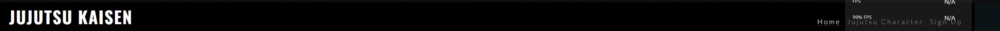
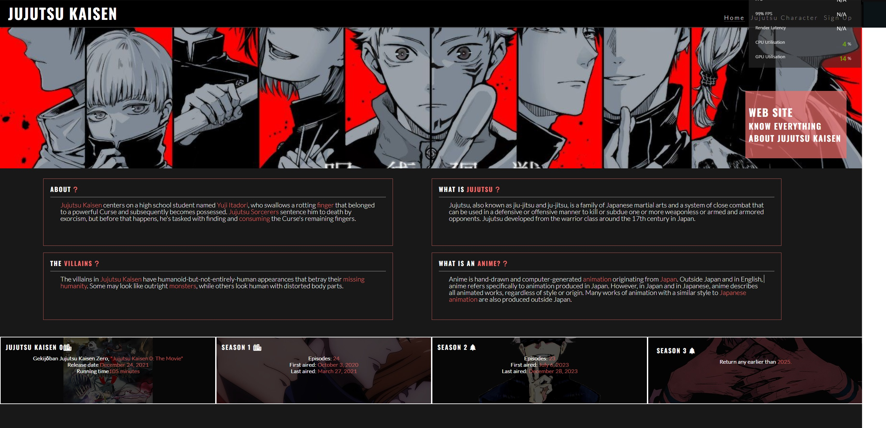
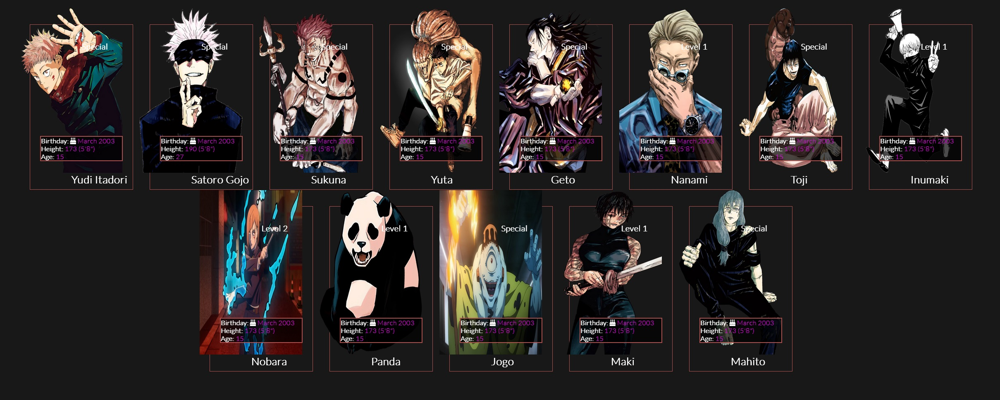

# __Share Knowledge__

Jujutsu Kaisen is a project created to know about the Jujutsu Kaisen Anime, released in Japan in March 2018. The web site is made for fans of animation with a character, a registration screen for more news and information and curiosities about the jujutsu universe.

## Features

### Existing Features

- __Navigation Bar__
    -Navigation bar, allows the user to navigate between our three pages, Home, Character and Sign Up, responsive bar and easily allows the user to navigate through the page.

- __Home Page__
    -This section introduces the season and curiosities of Jujutsu, like info about episodes, duration or Publicated.

- __Character Section__
    -This section introduces the user to see the most famous Characters ever in Jujutsu Kaisen anime.

- __Footer Section__
    *the footer includes links to the social media sites for the Share Knowledge project, which will open in a new tab.

- __The Sign-Up Page__
- The sign-up page allows the user to register and become a member of our website.

### Features Left to Implement
-   Would be nice include a page of the best battles with videos anf gifs.

## Testing
-   I tested everything after finish the project.
-   

## Validator Testing
- No errors were returned when passing through the official [W3C](https://validator.w3.org/) validator.
- No errors were found when passing through the official [Jigsaw](https://jigsaw.w3.org/css-validator/) validator

# Deployment
> The site was deployed to GitHub pages. The steps are:
> In the GitHub repository, navigate to the Settings tab
> From the source section drop-down menu, select the Master Branch
> Once the master branch has been selected, the page will be automatically refreshed with a detailed ribbon display to indicate the successful deployment.

- The live link can be found here: [My Site](https://henriquezanini97.github.io/jujutsu-kaisen)

## Credits:
- __Content__ 
    -The icons in the footer were taken from Font Awesome
- __Media__
    -All the background images are from this open-source website: https://pixabay.com/